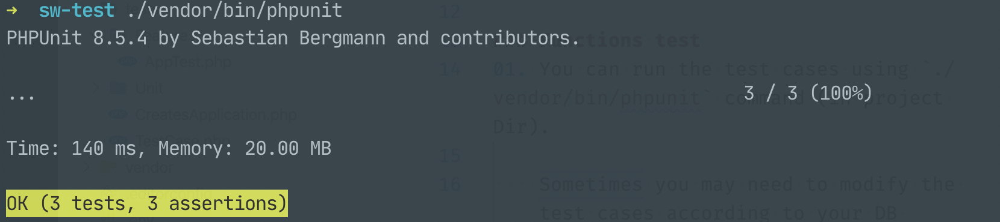
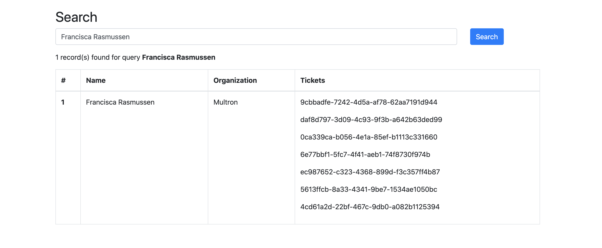

## Assignment (Laravel)

### Setup guide

1.  Run the following command to install the application
    ```bash
    composer install
    php artisan key:generate
    ```
2.  Run `php artisan serve` for run the development server (make sure server is run `http://127.0.0.1:8000`)

### Functions test

1.  You can run the test cases using `./vendor/bin/phpunit` command (in the project Dir).
    

2. You can search resources using the search box. For the first time, all the records are shown in the table format. once you enter the query, records are filtered according to the query.



If you have any questions feel free to contact me or e-mail (nishantha.plus@gmail.com)
